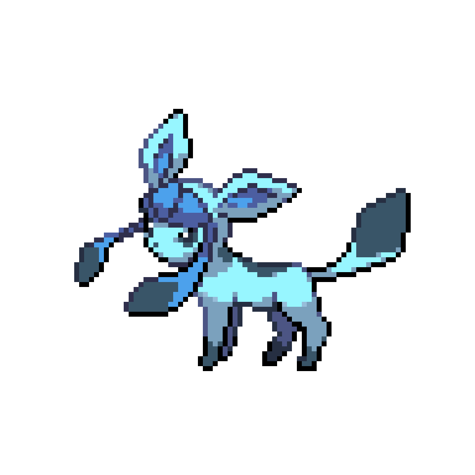

こんにちは世界

こんにちは
世界

こんにちは  
世界

こんにちは

世界

**こんにちは世界**

- レベル 0
- レベル 0
  - レベル 1
  - レベル 1
    - レベル 2
    - レベル 2
  - レベル 1
- レベル 0

- 1. レベル 0
1. レベル 0
   1. レベル 1 (半角スペース 1x3 = 3 個)
   1. レベル 1
      1. レベル 2 (半角スペース 2x3 = 6 個)
      1. レベル 2
   1. レベル 1
1. レベル 0

# レベル0
ほげ

## レベル1
ふが

### レベル2
ぴよ

ほげ[ふが](https://github.com/)ぴよ

docs/index.md から docs/fuga/hoge.md にリンクを貼る場合
[ほげ](./fuga/hoge.md)

docs/index.md で docs/hoge.png の画像を表示したい場合

